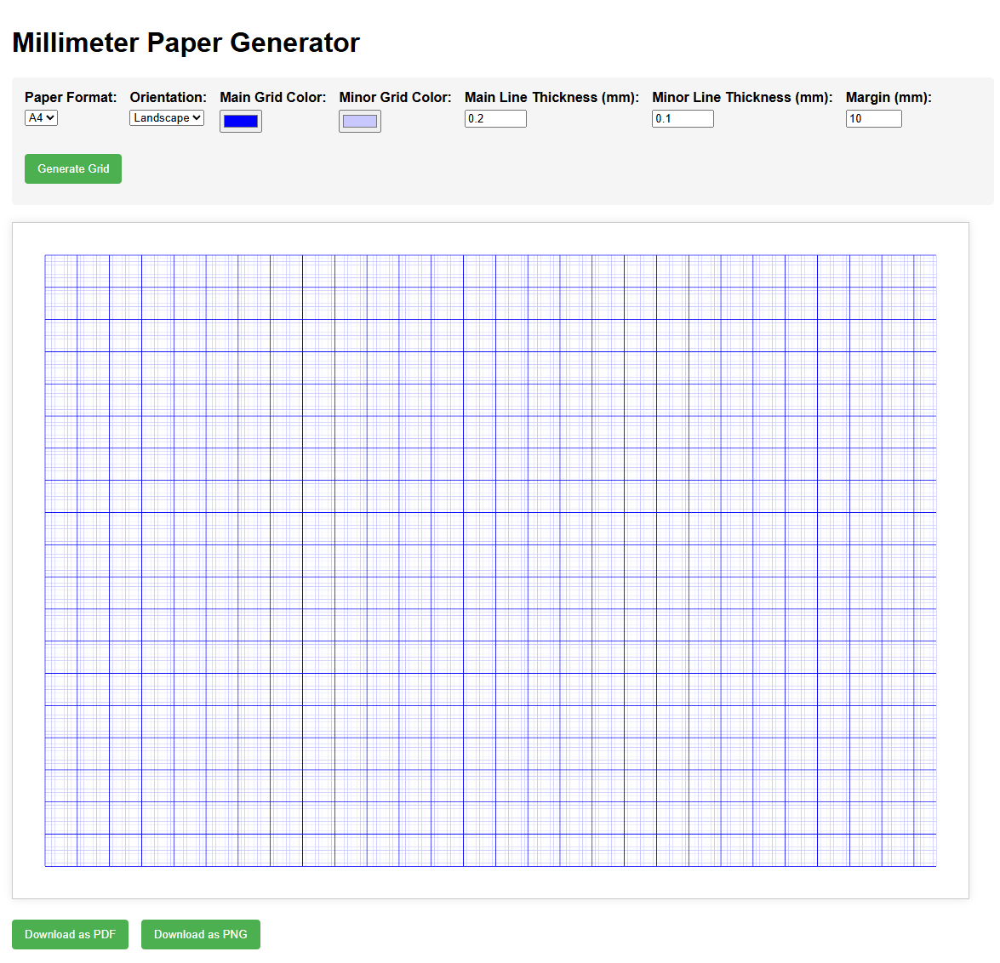

# Millimeter Paper Generator

This project is a versatile tool for generating customizable millimeter grid paper in various formats. It includes both a Python script and a web interface for creating printable millimeter paper with customizable grid colors, line thickness, and margins. Note that the Python and HTML implementations are different and each uses its own code.

## Features

- Generate A3 or A4 millimeter paper
- Portrait or landscape orientation
- Customizable grid colors (main and minor grid lines)
- Adjustable line thickness
- Configurable margins
- Output as PDF or PNG
- Command-line interface and web interface options

## Installation

1. Clone this repository:
   ```
   git clone https://github.com/yourusername/mm_paper.git
   cd mm_paper
   ```

2. Install required dependencies:
   ```
   pip install -r requirements.txt
   ```

## Usage

### Command-line Interface

```bash
python mm_paper_generator.py [options]
```

#### Options:

- `--format`: Paper format (`A3` or `A4`, default: `A4`)
- `--orientation`: Paper orientation (`portrait` or `landscape`, default: `portrait`)
- `--main-color`: Color for main grid lines (10mm) in R,G,B format (default: `0,0,255` - blue)
- `--minor-color`: Color for minor grid lines (1mm) in R,G,B format (default: `200,200,255` - light blue)
- `--main-thickness`: Thickness of main lines in pixels (default: `1`)
- `--minor-thickness`: Thickness of minor lines in pixels (default: `1`)
- `--margin`: Margin size in mm (default: `10`)
- `--output`: Output filename (default: `mm_paper.pdf`)

#### Example:

```bash
python mm_paper_generator.py --format A4 --orientation landscape --main-color 255,0,0 --minor-color 255,200,200 --output red_grid.pdf
```

### Web Interface

Open `index.html` in your web browser to use the interactive web interface:

1. Select paper format, orientation, and customize grid properties
2. Click "Generate Grid" to preview the millimeter paper
3. Use "Download as PDF" or "Download as PNG" buttons to save your design

You can also use this Millimeter Paper Generator via web page: https://kavierim.github.io/mm_paper/



## Examples

- Standard blue millimeter paper (A4):
  ```
  python mm_paper_generator.py
  ```

- Red grid paper with landscape orientation:
  ```
  python mm_paper_generator.py --main-color 255,0,0 --minor-color 255,200,200 --orientation landscape
  ```

## Requirements

- Python 3.6 or higher
- Pillow
- ReportLab

## License

MIT License

Copyright (c) 2023 Your Name

Permission is hereby granted, free of charge, to any person obtaining a copy
of this software and associated documentation files (the "Software"), to deal
in the Software without restriction, including without limitation the rights
to use, copy, modify, merge, publish, distribute, sublicense, and/or sell
copies of the Software, and to permit persons to whom the Software is
furnished to do so, subject to the following conditions:

The above copyright notice and this permission notice shall be included in all
copies or substantial portions of the Software.

THE SOFTWARE IS PROVIDED "AS IS", WITHOUT WARRANTY OF ANY KIND, EXPRESS OR
IMPLIED, INCLUDING BUT NOT LIMITED TO THE WARRANTIES OF MERCHANTABILITY,
FITNESS FOR A PARTICULAR PURPOSE AND NONINFRINGEMENT. IN NO EVENT SHALL THE
AUTHORS OR COPYRIGHT HOLDERS BE LIABLE FOR ANY CLAIM, DAMAGES OR OTHER
LIABILITY, WHETHER IN AN ACTION OF CONTRACT, TORT OR OTHERWISE, ARISING FROM,
OUT OF OR IN CONNECTION WITH THE SOFTWARE OR THE USE OR OTHER DEALINGS IN THE
SOFTWARE.